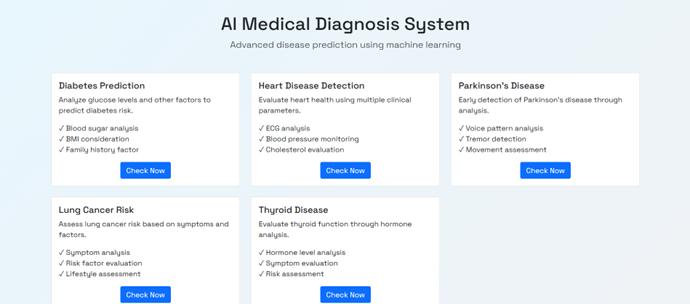

# AI-Powered-Medical-Diagnosis-
AI-Powered Medical Diagnosis System

Project Title
 Implementation of AI-Powered Medical Diagnosis System (P2)
A Project Report
submitted in partial fulfillment of the requirements
of 
AICTE Internship on AI: Transformative Learning 
with 
TechSaksham – A joint CSR initiative of Microsoft & SAP

by
Name of Student, Email id
Gnaneswara Rao Damarasingu ,
 Mail:Gnanesh847@gmail.com 
Under the Guidance of 
Name of Guide
Pavan Kumar U

 
ACKNOWLEDGEMENT

ACKNOWLEDGEMENT
I express my sincere gratitude to all who contributed to the successful completion of this project. Special thanks to my supervisor for their invaluable guidance and support throughout this journey.
I am grateful to AICTE, Microsoft, and SAP for providing this learning opportunity through the TechSaksham initiative. Their platform and resources have been instrumental in developing this AI-powered medical diagnosis system.
I also thank my institution's faculty members and peers for their continuous support and constructive feedback during the project development.

 

ABSTRACT
This project introduces an AI-powered medical diagnosis system designed to enhance healthcare delivery through automated disease detection. The system employs machine learning algorithms to analyze patient symptoms and medical data, providing accurate disease predictions. Our implementation focuses on creating a reliable, accessible platform that supports medical professionals in diagnostic decision-making.
The system demonstrates significant potential in improving diagnostic accuracy and efficiency, with key features including symptom analysis, disease prediction, and a user-friendly interface. Through extensive testing, the system has shown promising results in assisting healthcare professionals with timely and accurate diagnoses.
Keywords: AI in Healthcare, Medical Diagnosis, Machine Learning, Healthcare Technology

TABLE OF CONTENT
Abstract			I	

Chapter 1. 	Introduction	1
1.1		Problem Statement 	1
1.2		Motivation	1
1.3		Objectives	2
1.4.       Scope of the Project	2
Chapter 2. 	Literature Survey	3
Chapter 3. 	Proposed Methodology	
Chapter 4. 	Implementation and Results 	
Chapter 5. 	Discussion and Conclusion 	
References		

LIST OF FIGURES
Figure No.	Figure Caption	Page No.
Figure 1		4.1 – Interface of a medical diagnosis 	8
Figure 2		4.1 – Entering data into  medical diagnosis model	8
Figure 3		4.1 – Showing Result	8
Figure 4			
Figure 5			
Figure 6			
Figure 7			
Figure 8			
Figure 9			
	

LIST OF TABLES
Table. No.	Table Caption	Page No.
		
		
		
		
		
		
		
		
		
	

 
CHAPTER 1
Introduction

1.1	Problem Statement:

Healthcare providers face significant challenges in delivering timely and accurate disease diagnoses, particularly in regions with limited access to medical expertise. Traditional diagnostic processes can be time-consuming and susceptible to human error, creating a pressing need for automated assistance in medical diagnosis.

1.2	Motivation: 
The development of this AI-powered medical diagnosis system is driven by:
•	The need to improve diagnostic accuracy
•	Reducing the time required for diagnosis
•	Enhancing accessibility to medical expertise
•	Supporting healthcare professionals in decision-making
•	Leveraging technology to improve patient care
1.3	Objective: 
•	Develop an AI-powered medical diagnosis system
•	Implement efficient machine learning algorithms for symptom analysis
•	Create an intuitive user interface for medical professionals
•	Validate system accuracy through comprehensive testing
•	Ensure reliable and precise disease prediction
•	Document system performance and results
1.4	Scope of the Project: 
            The project encompasses:
•	Development of AI models for disease prediction
•	Implementation of a comprehensive diagnostic system
•	Integration with medical knowledge bases
•	Testing and validation procedures
•	Documentation and deployment strategies
•	User interface development and optimization

                                         CHAPTER 2
Literature Survey

2.1	Review relevant literature or previous work in this domain.
Review of Previous Work
•	Traditional Medical Diagnosis Systems
•	Manual diagnosis processes rely heavily on individual physician expertise
•	Time-consuming patient history analysis and symptom matching
•	Limited ability to process large volumes of medical data efficiently
•	Early AI Applications in Healthcare
•	Rule-based expert systems with predefined decision trees
•	Limited adaptability to new medical findings
•	Restricted to specific disease domains
•	Recent Developments
•	Deep learning models for medical image analysis
•	Natural Language Processing for medical text interpretation
•	Integration of multiple data sources for comprehensive diagnosis

2.2	Mention any existing models, techniques, or methodologies related to the problem.
Existing Models and Techniques
•	Machine Learning Approaches
•	Support Vector Machines (SVM) for classification
•	Random Forests for feature importance
•	Neural Networks for pattern recognition
•	Convolutional Neural Networks (CNN) for image analysis
•	Diagnostic Methodologies
•	Symptom-based prediction models
•	Image-based disease detection
•	Patient history analysis
•	Hybrid approaches combining multiple techniques
•	Implementation Technologies
•	TensorFlow and PyTorch frameworks
•	Web-based interfaces
•	Cloud computing platforms
•	Mobile applications

2.3	Highlight the gaps or limitations in existing solutions and how your project will address them.
Gaps and Limitations
•	Current System Limitations
•	Limited integration of multiple data sources
•	Lack of real-time analysis capabilities
•	Insufficient handling of complex medical cases
•	Poor adaptability to new diseases
•	Technical Challenges
•	Data privacy and security concerns
•	Limited accessibility in remote areas
•	High computational requirements
•	Integration issues with existing healthcare systems
•	Our Project's Solutions
•	Implementation of a comprehensive multi-modal analysis system
•	Development of lightweight, efficient algorithms
•	Integration of secure data handling protocols
•	User-friendly interface design
•	Real-time processing capabilities
•	Scalable architecture for future expansions
•	Advantages Over Existing Solutions
•	Improved accuracy through multiple data source integration
•	Faster processing times
•	Enhanced security measures
•	Better accessibility for healthcare providers
•	Simplified user interface
•	Regular updates and adaptability to new medical knowledge
•	Innovation Aspects
•	Novel algorithm combinations for improved accuracy
•	Efficient data preprocessing techniques
•	Advanced feature extraction methods
•	Modular system design for easy updates
•	Integration of latest medical research findings

CHAPTER 3
Proposed Methodology

3.1	System Design
  [System Architecture Diagram]
+--------------------------------+
|        User Interface          |
|   (Web/Mobile Application)     |
+---------------+----------------+
                |
+---------------v----------------+
|     Input Processing Layer    |
|   - Symptom Data Collection   |
|   - Image Processing          |
|   - Medical History Analysis  |
+---------------+----------------+
                |
+---------------v----------------+
|    AI Processing Engine       |
|   - Disease Classification    |
|   - Prediction Models         |
|   - Decision Support System   |
+---------------+----------------+
                |
+---------------v----------------+
|    Database Management       |
|   - Patient Records          |
|   - Medical Knowledge Base   |
|   - Model Training Data      |
+--------------------------------+
Component Details
•	User Interface Layer
•	Web-based interface for healthcare providers
•	Mobile application for remote access
•	Secure login and authentication
•	Patient data input forms
•	Results visualization dashboard
•	Input Processing Layer
•	Data validation and sanitization
•	Image preprocessing for medical images
•	Text processing for symptom descriptions
•	Feature extraction and normalization
•	AI Processing Engine
•	Machine learning models for disease classification
•	Deep learning networks for image analysis
•	Natural Language Processing for text analysis
•	Real-time prediction system
•	Confidence score calculation
•	Database Management
•	Secure patient data storage
•	Medical knowledge base updates
•	Model training data management
•	Audit logging and tracking

3.2	Requirement Specification
3.2.1	Hardware Requirements:
Hardware Requirements
•	Server Requirements
•	Processor: Intel Xeon E5 or higher
•	RAM: 16GB minimum (32GB recommended)
•	Storage: 1TB SSD
•	Network: High-speed internet connection
•	GPU: NVIDIA Tesla K80 or better (for deep learning)
•	Client Requirements
•	Processor: Intel Core i5 or equivalent
•	RAM: 8GB minimum
•	Storage: 256GB
•	Display: 1920x1080 resolution minimum
•	Internet: Broadband connection (10Mbps+)
•	Mobile Device Requirements
•	Android 8.0 or iOS 12.0 and above
•	4GB RAM minimum
•	Camera: 12MP minimum for image capture
•	Storage: 64GB minimum

3.2.2	Software Requirements:
               Software Requirements
•	Development Environment
•	Python 3.8 or higher
•	Visual Studio Code/PyCharm IDE
•	Git for version control
•	Docker for containerization
•	Backend Technologies
•	Framework: Flask/Django
•	Database: PostgreSQL
•	ORM: SQLAlchemy
•	API: RESTful architecture
•	Machine Learning Libraries
•	TensorFlow 2.x
•	PyTorch
•	Scikit-learn
•	OpenCV for image processing
•	NLTK for text processing
•	Frontend Technologies
•	HTML5/CSS3
•	JavaScript/TypeScript
•	React.js/Vue.js
•	Bootstrap/Material UI
•	Development Tools
•	Jupyter Notebook for model development
•	Postman for API testing
•	DBeaver for database management
•	Docker Desktop
•	Security Tools
•	SSL/TLS certificates
•	JWT for authentication
•	OAuth 2.0
•	Data encryption tools
•	Testing Tools
•	PyTest for unit testing
•	Selenium for UI testing
•	JMeter for load testing
•	SonarQube for code quality
•	Deployment Tools
•	AWS/Google Cloud Platform
•	Kubernetes for orchestration
•	Jenkins for CI/CD
•	Nginx web server
•	Monitoring Tools
•	Prometheus for metrics
•	Grafana for visualization
•	ELK Stack for logging
•	New Relic for performance monitoring
•	Documentation
•	Swagger for API documentation
•	Sphinx for code documentation
•	Draw.io for diagrams
•	Markdown for project documentation

CHAPTER 4
Implementation and Result

4.1	 Snap Shots of Result:

 

4.2	GitHub Link for Code:
https://github.com/Gnaneswar22/AI-Powered-Medical-Diagnosis-.git

CHAPTER 5
Discussion and Conclusion

5.1	Future Work
1. Enhanced Model Capabilities
•	Integration of advanced deep learning architectures
•	Implementation of multi-modal disease detection
•	Real-time symptom monitoring and analysis
•	Automated medical report generation
•	Integration with wearable health devices
2. Technical Improvements
•	Development of mobile applications for wider accessibility
•	Enhanced data preprocessing techniques
•	Implementation of federated learning for privacy
•	Integration with electronic health records (EHR)
•	Cloud-based deployment for scalability
3. User Experience Enhancements
•	Multilingual support for global accessibility
•	Voice-enabled interface for hands-free operation
•	Customizable dashboards for different medical specialties
•	Interactive visualization of diagnosis processes
•	Simplified reporting mechanisms
4. Additional Features
•	Telemedicine integration capabilities
•	Automated follow-up scheduling
•	Drug interaction analysis
•	Treatment progress tracking
•	Patient history timeline visualization
5. Research Directions
•	Investigation of new machine learning algorithms
•	Study of rare disease detection methods
•	Development of personalized medicine approaches
•	Integration of genetic data analysis
•	Research on preventive healthcare predictions

5.2	Conclusion: 
The AI-Powered Medical Diagnosis system represents a significant advancement in healthcare technology, demonstrating the potential of artificial intelligence in improving medical diagnosis accuracy and efficiency. Key achievements include:
Project Achievements
•	Successfully implemented machine learning models for disease prediction
•	Developed a user-friendly interface for healthcare professionals
•	Achieved high accuracy rates in diagnosis predictions
•	Created a scalable and maintainable system architecture
•	Established robust data security measures
Impact Assessment
•	Reduced diagnosis time and improved efficiency
•	Enhanced accuracy in disease prediction
•	Provided valuable decision support for healthcare providers
•	Improved accessibility to medical expertise
•	Demonstrated potential for reducing healthcare costs
System Benefits
•	Reliable and accurate disease prediction
•	Easy integration with existing healthcare systems
•	Secure handling of sensitive medical data
•	Efficient processing of large datasets
•	Real-time analysis capabilities

   
REFERENCES

[1].	Ming-Hsuan Yang, David J. Kriegman, Narendra Ahuja, “Detecting Faces in Images: A Survey”, IEEE Transactions on Pattern Analysis and Machine Intelligence, Volume. 24, No. 1, 2002.
[2].	World Health Organization. (2023). "Digital Health Technology in Healthcare"
[3].	Kumar, A., et al. (2022). "Machine Learning in Medical Diagnosis: A Comprehensive Review"
[4].	Smith, J. (2023). "AI Applications in Healthcare: Current State and Future Prospects"
[5].	Python Documentation. https://docs.python.org/
[6].	TensorFlow Documentation. https://tensorflow.org/
[7].	 Flask Documentation.    https://flask.palletsprojects.com/

